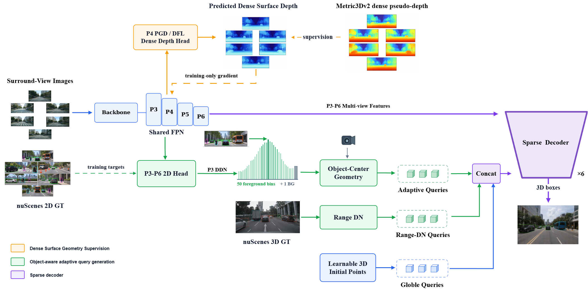

# DGAQ-3D

**Dense Geometry-Regularized Global-Adaptive Query Learning for Multi-Camera 3D Object Detection**

基于稠密表面几何正则、对象感知查询生成与稀疏多尺度解码的多相机 3D 目标检测。

[方法概览](#方法概览) · [实验结果](#实验结果) · [快速开始](#快速开始) · [训练与评测](#训练与评测) · [代码索引](#代码索引)

DGAQ-3D framework. Orange: training-only dense surface geometry; green: object-aware query generation and Range-DN; purple: sparse multi-view decoder.

## 简介

DGAQ-3D 建立在 [3DPPE](https://openaccess.thecvf.com/content/ICCV2023/html/Shu_3DPPE_3D_Point_Positional_Encoding_for_Transformer-based_Multi-Camera_3D_Object_ICCV_2023_paper.html) 代码体系之上，面向远距离目标和小投影目标中常见的深度监督稀疏、固定查询初始化偏离目标中心，以及单尺度图像交互不足等问题。

方法保留 900 个可学习 Global Query，同时从当前图像的二维目标证据中生成 Adaptive Query。两类查询在统一的六层稀疏 Decoder 中，从六相机 P3-P6 特征上聚合目标证据。Metric3Dv2 稠密伪深度仅作为训练期共享特征正则，不生成 Decoder reference，也不向最终 Decoder 注入 image-side 3D PE。

### 核心特性

- **Dense Surface Geometry**：使用 Metric3Dv2 离线度量伪深度监督 P4 PGD/DFL 分支，改善共享 FPN 的场景几何表达。
- **Object-Aware Query Generation (OAQG)**：通过多尺度二维 proposal、P3 实例中心 DDN 和相机反投影，为当前场景动态生成三维 Adaptive Query。
- **Global-Adaptive Sparse Decoding**：Global 与 Adaptive Query 共同使用 P3-P6、六相机、13 点可变形特征聚合。
- **Range-Modulated 3D Denoising**：训练 Decoder 修正可恢复的三维 reference 偏差，并拒绝范围相关的负查询。
- **Reproducibility Tools**：包含动态查询统计、距离/投影尺寸分析、配对定性导出和 nuScenes test 提交工具。

## 方法概览

### 1. 稠密表面几何正则

P4 深度分支预测像素级表面深度，并由离线 Metric3Dv2 伪深度以较低权重监督。该分支只在训练期提供梯度，推理时不运行 Metric3Dv2。

~~~text
P4 feature -> PGD/DFL dense-depth head -> predicted surface depth
                         ^
                         | training-only supervision
                  Metric3Dv2 pseudo-depth
~~~

仓库中的 **DenseGT** 指离线稠密伪深度，并非传感器采集的稠密真值。

### 2. 对象感知 Adaptive Query

StageA/OAQG 在 P3-P6 上预测 objectness、类别和二维框，并通过 SimOTA 与离线 nuScenes 2D GT 匹配。P3 DDN 使用 50 个 LID 前景深度 bin 和 1 个背景 bin 预测实例中心深度。保留候选经过：

~~~text
local maximum -> score threshold -> per-camera Top-K
~~~

二维中心与中心深度经相机反投影得到三维 reference：

~~~text
p_img   = [u * d, v * d, d, 1]^T
p_lidar = inverse(lidar2img) * p_img
ref_3d  = normalize(p_lidar, point_cloud_range)
~~~

Global Query 保证完整空间覆盖，Adaptive Query 提供当前图像中的对象先验。训练默认每相机最多 16 条、每帧最多 96 条 Adaptive Query；最终验证使用每相机 Top-24、总上限 144 条。

### 3. 稀疏多视角 Decoder

每层 Decoder 先执行 Query self-attention，再围绕三维 reference 学习 13 个采样点，将其投影到六个相机，并从 P3-P6 双线性采样图像特征。相机、尺度、采样点与通道组权重由查询内容和相机几何共同调制。六层 Decoder 持续更新 Query feature，并在每层相对同一组初始 reference 预测三维框；当前实现不将上一层预测中心反馈为下一层 reference。

## 实验结果

以下结果均来自 nuScenes validation。关键帧实验使用 train split 训练、单帧六相机输入和 <code>1600 x 640</code> 分辨率；one-sweep 只增加一帧历史图像，不使用 StreamPETR 式时序 memory。

| Method | Input | mAP ↑ | NDS ↑ | mATE ↓ | mASE ↓ | mAOE ↓ | mAVE ↓ | mAAE ↓ |
|---|---|---:|---:|---:|---:|---:|---:|---:|
| Local 3DPPE baseline | Keyframe | 0.4364 | 0.5076 | 0.7199 | 0.2735 | 0.3044 | 0.6217 | 0.1867 |
| 3DPPE + dense geometry | Keyframe | 0.4806 | 0.5384 | 0.6324 | 0.2651 | 0.3340 | 0.6006 | 0.1866 |
| **DGAQ-3D** | Keyframe | **0.5065** | **0.5652** | **0.5745** | **0.2589** | **0.2454** | 0.6235 | **0.1783** |
| **DGAQ-3D** | One-sweep | **0.5274** | **0.6001** | **0.5671** | **0.2560** | **0.2324** | **0.3936** | 0.1870 |

相对同设置本地 3DPPE keyframe baseline，DGAQ-3D keyframe 提升 **7.01 mAP** 和 **5.76 NDS** 个百分点，并将 mATE 降低 **0.1454 m**。

### 动态查询利用率

最终 <code>score_thr=0.05</code>、Top-24、144-query 推理设置下：

| Model | Samples | Mean | P95 | Max / Cap | Cap-hit rate |
|---|---:|---:|---:|---:|---:|
| Keyframe | 6019 | 54.11 | 104.10 | 144 / 144 | 0.3323% |
| One-sweep | 6019 | 53.77 | 104.00 | 144 / 144 | 0.2492% |

平均每帧只生成约 54 条 Adaptive Query，明显低于 144 条最坏情况预算。

## 快速开始

### 1. 环境

本仓库使用 OpenMMLab 1.x 代码栈，推荐 Python 3.8 与 PyTorch 1.x。先根据本机 CUDA 安装匹配的 PyTorch 和 <code>mmcv-full</code>，再安装其余依赖：

~~~bash
git clone https://github.com/bulongmao/DGAQ3D.git
cd DGAQ3D

export PYTHONPATH="$PWD:${PYTHONPATH:-}"
pip install -r requirements.txt
pip install einops
~~~

完整版本说明见 [install.md](install.md)。<code>mmcv-full</code> 必须与 PyTorch/CUDA 匹配，否则多尺度可变形注意力算子无法加载。

### 2. 数据与权重

建议目录结构：

~~~text
DGAQ3D/
├── ckpts/
│   └── dd3d_det_final.pth
├── data/
│   ├── nuscenes/
│   │   ├── maps/
│   │   ├── samples/
│   │   ├── sweeps/
│   │   ├── v1.0-trainval/
│   │   ├── petr/
│   │   │   ├── mmdet3d_nuscenes_30f_infos_train.pkl
│   │   │   └── mmdet3d_nuscenes_30f_infos_val.pkl
│   │   └── 2dgt/
│   │       └── nuscenes_train_2dgt.pkl
│   └── metric3d_depth/
└── projects/
~~~

配置支持通过环境变量指定附加监督：

~~~bash
export DENSEGT_DEPTH_ROOT="$PWD/data/metric3d_depth"
export NUSCENES_2DGT_PATH="$PWD/data/nuscenes/2dgt/nuscenes_train_2dgt.pkl"
~~~

Metric3Dv2 伪深度需要提前离线生成。二维 GT 可使用仓库脚本生成：

~~~bash
python tools/generate_nuscenes_2dgt.py \
  data/nuscenes/petr/mmdet3d_nuscenes_30f_infos_train.pkl \
  data/nuscenes/2dgt/nuscenes_train_2dgt.pkl \
  --data-root data/nuscenes \
  --min-box-size 2.0 \
  --min-visible-corners 4
~~~

## 训练与评测

### 关键帧训练

~~~bash
CFG=projects/configs/petrv2_depth/petrv2_depth_3dpe_dfl_vovnet_wogridmask_p4_1600x640_pdg_trainval_keyframe_densegt_far3d_stagea_top1_ddn_rangedn_lossd005.py
WORK=work_dirs/dgaq3d_keyframe

mkdir -p "$WORK"

CUDA_VISIBLE_DEVICES=0,1,2,3,4,5,6,7 \
PORT=28500 \
bash tools/dist_train.sh "$CFG" 8 \
  --work-dir "$WORK" \
  2>&1 | tee "$WORK/train.log"
~~~

断点续训：

~~~bash
CUDA_VISIBLE_DEVICES=0,1,2,3,4,5,6,7 \
PORT=28500 \
bash tools/dist_train.sh "$CFG" 8 \
  --work-dir "$WORK" \
  --resume-from "$WORK/epoch_10.pth" \
  2>&1 | tee -a "$WORK/train.log"
~~~

### 144-query 最终评测

~~~bash
CKPT="$WORK/epoch_25.pth"

CUDA_VISIBLE_DEVICES=0,1,2,3,4,5,6,7 \
PORT=29620 \
bash tools/dist_test.sh "$CFG" "$CKPT" 8 \
  --eval bbox \
  --cfg-options \
    model.pts_bbox_head.far3d_stagea_cfg.score_thr=0.05 \
    model.pts_bbox_head.far3d_stagea_cfg.sample_max_per_cam=24 \
    model.pts_bbox_head.far3d_stagea_cfg.topk_per_cam=24 \
    model.pts_bbox_head.far3d_stagea_cfg.max_adaptive_queries=144 \
    model.pts_bbox_head.far3d_stagea_cfg.depth_topk=1 \
    model.pts_bbox_head.far3d_stagea_cfg.depth_aggregation=window \
    model.pts_bbox_head.far3d_stagea_cfg.depth_window=3
~~~

也可使用封装脚本同时输出 nuScenes 指标与 Adaptive Query 统计：

~~~bash
TARGETS=keyframe \
KEYFRAME_WORK="$WORK" \
KEYFRAME_EPOCH=25 \
bash tools/eval_final_rangedn_q144.sh
~~~

### 官方 nuScenes test 协议

仓库提供 train+val、60 epochs、官方 test server 提交配置。完整的数据审计、训练和 JSON 导出流程见：

- [TABLE2_TEST_PROTOCOL.md](TABLE2_TEST_PROTOCOL.md)
- [train+val/test config](projects/configs/petrv2_depth/petrv2_depth_3dpe_dfl_vovnet_wogridmask_p4_1600x640_pdg_trainval_keyframe_densegt_far3d_stagea_top1_ddn_rangedn_trainval60_test.py)

README 中的数值是 validation 结果，不应替代 test server 返回的官方指标。

## 主要配置

| Experiment | Config |
|---|---|
| Local 3DPPE keyframe baseline | [keyframe.py](projects/configs/petrv2_depth/petrv2_depth_3dpe_dfl_vovnet_wogridmask_p4_1600x640_pdg_trainval_keyframe.py) |
| Dense geometry only | [keyframe_densegt.py](projects/configs/petrv2_depth/petrv2_depth_3dpe_dfl_vovnet_wogridmask_p4_1600x640_pdg_trainval_keyframe_densegt.py) |
| DGAQ-3D keyframe + Range-DN | [rangedn_lossd005.py](projects/configs/petrv2_depth/petrv2_depth_3dpe_dfl_vovnet_wogridmask_p4_1600x640_pdg_trainval_keyframe_densegt_far3d_stagea_top1_ddn_rangedn_lossd005.py) |
| OAQG auxiliary-only + Range-DN | [auxonly_rangedn_lossd005.py](projects/configs/petrv2_depth/petrv2_depth_3dpe_dfl_vovnet_wogridmask_p4_1600x640_pdg_trainval_keyframe_densegt_far3d_stagea_top1_ddn_auxonly_rangedn_lossd005.py) |
| DGAQ-3D one-sweep + Range-DN | [sweep1_rangedn_lossd005.py](projects/configs/petrv2_depth/petrv2_depth_3dpe_dfl_vovnet_wogridmask_p4_1600x640_pdg_trainval_sweep1_densegt_far3d_stagea_top1_ddn_rangedn_lossd005.py) |
| Official train+val/test protocol | [trainval60_test.py](projects/configs/petrv2_depth/petrv2_depth_3dpe_dfl_vovnet_wogridmask_p4_1600x640_pdg_trainval_keyframe_densegt_far3d_stagea_top1_ddn_rangedn_trainval60_test.py) |

## 分析工具

| Tool | Purpose |
|---|---|
| [eval_stagea_epochs_with_query_stats.sh](tools/eval_stagea_epochs_with_query_stats.sh) | 批量评测 checkpoint 并统计动态查询数量 |
| [analyze_range_size_breakdown.py](tools/analyze_range_size_breakdown.py) | 距离、相对距离和二维投影尺寸分桶分析 |
| [eval_range_size_breakdown.sh](tools/eval_range_size_breakdown.sh) | 配对 bootstrap 分桶评测入口 |
| [export_paired_qualitative.py](tools/export_paired_qualitative.py) | 基线/本文方法的配对候选筛选与同视角渲染 |
| [paper_qualitative_layout.py](tools/paper_qualitative_layout.py) | 将定性案例排版为论文 PNG/PDF |
| [diagnose_pred_depth_map.py](tools/diagnose_pred_depth_map.py) | 稠密表面深度诊断 |
| [diagnose_stagea_proposal_depth.py](tools/diagnose_stagea_proposal_depth.py) | OAQG proposal 与实例中心深度诊断 |

工具测试：

~~~bash
python -m unittest \
  tools.test_range_size_eval_utils \
  tools.test_export_paired_qualitative \
  tools.test_paper_qualitative_layout
~~~

## 代码索引

| Component | Location |
|---|---|
| Dense pseudo-depth and offline 2D GT loading | [loading.py](projects/mmdet3d_plugin/datasets/pipelines/loading.py) |
| 2D GT synchronization with image augmentation | [transform_3d.py](projects/mmdet3d_plugin/datasets/pipelines/transform_3d.py) |
| OAQG, SimOTA, P3 DDN, Adaptive Query and Range-DN | [petrv2_depth_head.py](projects/mmdet3d_plugin/models/dense_heads/petrv2_depth_head.py) |
| Camera-aware sparse multi-scale decoder | [petr_far3d_transformer.py](projects/mmdet3d_plugin/models/utils/petr_far3d_transformer.py) |

## 复现说明

- 关键帧是主设置；one-sweep 是输入扩展，不包含查询记忆或长时序建模。
- Metric3Dv2 只用于离线生成训练标签，模型部署时无需加载 Metric3Dv2。
- 训练默认查询上限为 96；Top-24/144 是验证集上采用的最终推理预算。
- 预训练权重、nuScenes 数据和 Metric3Dv2 伪深度不随仓库分发。
- 本仓库的最终稀疏 Decoder 不消费由表面深度生成的 image-side 3D positional encoding。

## 致谢

本项目基于并受益于以下工作：

- [3DPPE](https://openaccess.thecvf.com/content/ICCV2023/html/Shu_3DPPE_3D_Point_Positional_Encoding_for_Transformer-based_Multi-Camera_3D_Object_ICCV_2023_paper.html)
- [PETR](https://github.com/megvii-research/PETR)
- [Far3D](https://arxiv.org/abs/2308.09616)
- [Metric3Dv2](https://arxiv.org/abs/2404.15506)
- [CaDDN](https://arxiv.org/abs/2103.01100)
- [nuScenes](https://www.nuscenes.org/)

感谢上述项目、论文与数据集的作者。若使用本仓库，请同时遵循其许可证与数据使用条款。

## License

本仓库采用 [Apache License 2.0](LICENSE)。
